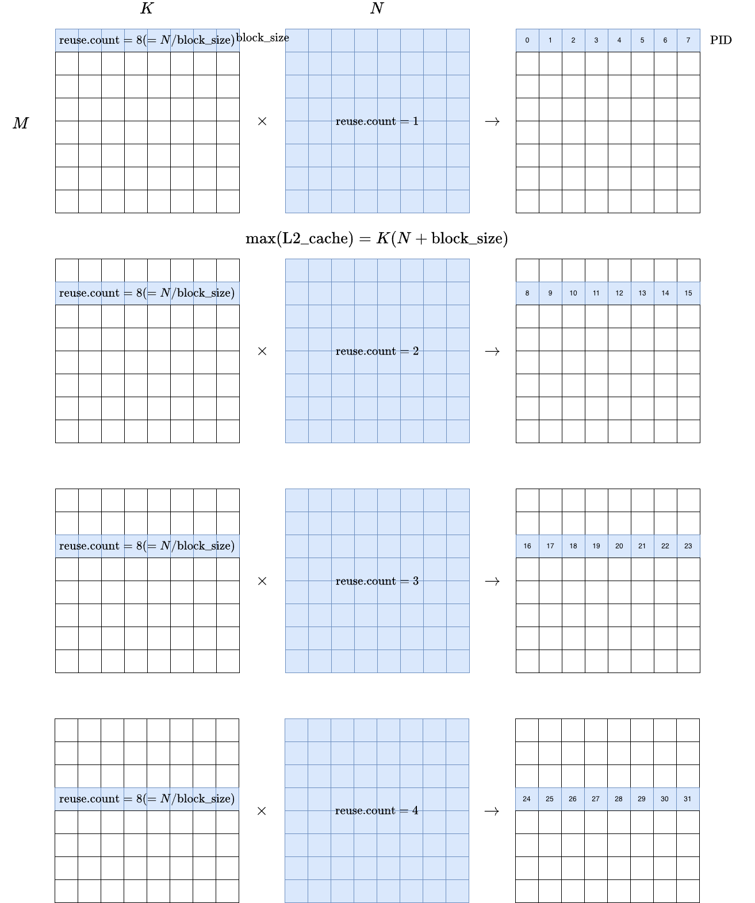
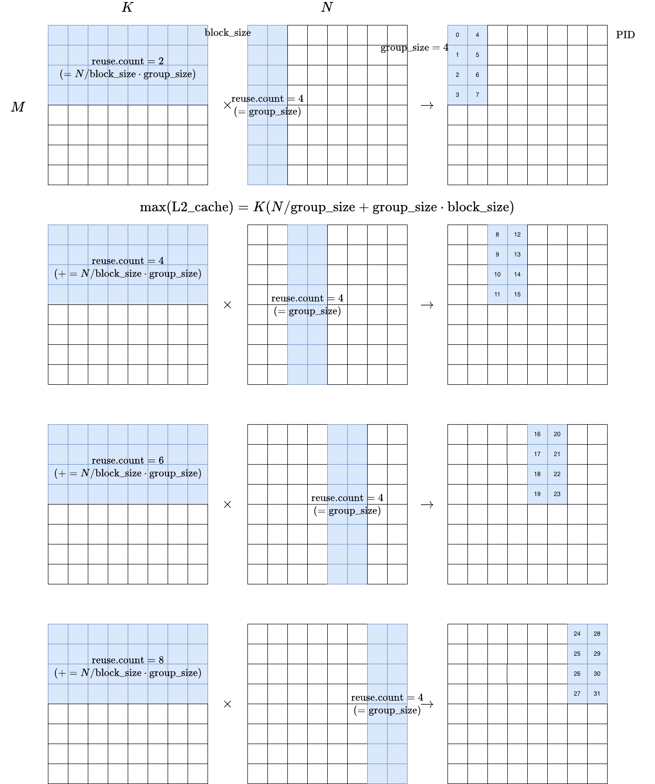

# `matmul` module
Vanilla matrix multiplication module

## Blueprint
```python3
# inputs
A  # with shape (M, K)
B  # with shape (K, N)
bias  # with shape (N)

# output
A * B + bias  # with shape (M, N)
```
- Each subprocess calculates part of the resulting matrix: `(BM, BN)`
  - `BM` and `BN` are GPU kernel parameters that are autotuned just-in-time by triton compiler
  - Each iteration of each subprocess multiply-accumulates `(BM, BK) * (BK, BN)`
- **PID grouped ordering**
  - For the first four rows, memory access of vanilla row-wise kernel is:
    - 
  - On the other hand, memory access of grouped kernel with `group_size = 4` is:
    - 
  - Here we can see that
    - row-wise kernel is special case of grouped kernel with `group_size = 1`
    - `group_size` balances between cache size and cache hit rate
      - optimal when `group_size = sqrt(N / block_size)`
- See also [official tutorial](https://triton-lang.org/main/getting-started/tutorials/03-matrix-multiplication.html#sphx-glr-getting-started-tutorials-03-matrix-multiplication-py)

## How to run
```bash
python3 test_and_bench.py
```

## Take-home message
- matrix multiplication in Triton is not that hard (straightforward compared to CUDA)
- PyTorch modules are picky with respect to choice of datatypes
  - does not support `torch.float8_e5m2` inputs yet, as of Nov 2025
  - all inputs must be of same datatype
    - `F.linear` : input, weight, bias must be of same dtype
- Triton kernels allow various choice of datatypes
